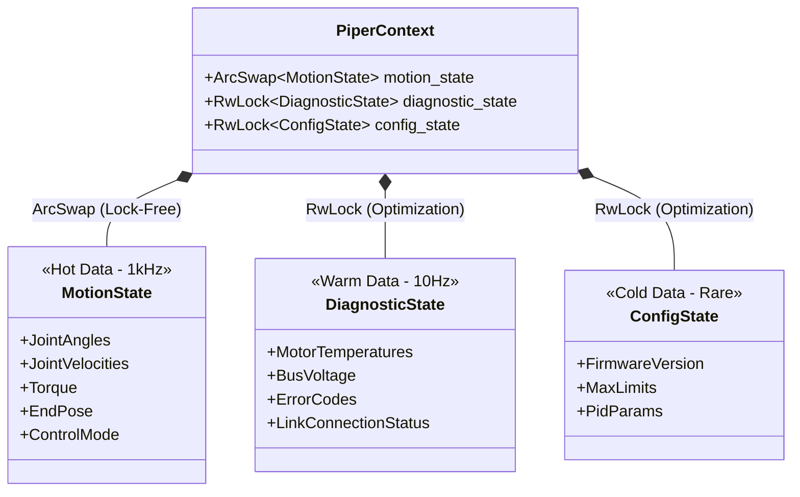

# Piper-RS 项目架构设计文档

## 1. 项目愿景

构建一个**高性能、跨平台、零抽象开销**的 Rust SDK，专用于松灵 Piper 机械臂的高频力控（>1kHz）。

* **Linux:** 基于 SocketCAN (内核级性能)。
* **Windows/macOS:** 基于 `rusb` 实现用户态 GS-USB 驱动 (免驱/通用)。
* **核心特性:** 类型安全、无锁并发读取、位级协议解析。

---

## 2. 技术栈选型 (Crates)

| 模块 | Crates | 用途说明 |
| --- | --- | --- |
| **CAN 接口** | `embedded-can` | 定义统一的 `blocking::Can` Trait，作为抽象标准。 |
| **Linux 后端** | `socketcan` | Linux 原生 CAN 支持。 |
| **USB 后端** | `rusb` | Windows/Mac 下操作 USB 设备，实现 GS-USB 协议。 |
| **协议解析** | `bilge` | **核心库**。用于处理位操作、非对齐数据，替代 serde。 |
| **并发模型** | `crossbeam-channel` | 高性能 MPSC 通道，用于发送控制指令。 |
| **状态共享** | `arc-swap` | RCU (Read-Copy-Update) 机制，实现无锁读取最新状态。 |
| **错误处理** | `thiserror` | **SDK 内部使用**。定义精确的错误枚举。 |
| **应用层错误** | `anyhow` | **Example/App 使用**。处理顶层错误链。 |
| **数学运算** | `nalgebra` | (可选) 如果 SDK 包含正逆运动学求解，使用此库。 |
| **日志** | `tracing` | 结构化日志记录。 |

---

## 3. 目录结构规划

```text
piper-rs/
├── Cargo.toml              # 定义 dependencies 和 features
├── examples/               # 示例代码 (使用 anyhow)
│   ├── read_state.rs       # 简单的读取打印
│   ├── torque_control.rs   # 力控 demo
│   └── configure_can.rs    # 配置 CAN 波特率工具
├── src/
│   ├── lib.rs              # 库入口，模块导出
│   ├── error.rs            # 定义全局 PiperError (thiserror)
│   ├── builder.rs          # PiperBuilder (统一构造入口)
│   │
│   ├── can/                # CAN 通讯适配层
│   │   ├── mod.rs          # 条件编译入口 (Type Alias 定义)
│   │   ├── socket.rs       # [Linux] SocketCAN 封装
│   │   └── gs_usb/         # [Win/Mac] GS-USB 协议实现
│   │       ├── mod.rs      # 实现 embedded-can Trait
│   │       ├── protocol.rs # GS-USB 控制帧定义
│   │       └── device.rs   # 基于 rusb 的设备查找与读写
│   │
│   ├── protocol/           # 协议定义 (业务无关，纯数据)
│   │   ├── mod.rs
│   │   ├── ids.rs          # CAN ID 常量/枚举
│   │   ├── feedback.rs     # 机械臂反馈帧 (使用 bilge)
│   │   └── control.rs      # 控制指令帧 (使用 bilge)
│   │
│   └── driver/             # 核心逻辑 (业务相关)
│       ├── mod.rs
│       ├── robot.rs        # 对外的高级 Piper 对象 (API)
│       └── pipeline.rs     # 线程管理、IO Loop、ArcSwap 更新逻辑

```

---

## 4. 关键模块详细设计

### 4.1. 错误处理体系 (`src/error.rs`)

这是区分 Library 和 App 的关键。SDK 内部绝对不允许 panic，也不应该吞掉错误细节。

```rust
use thiserror::Error;

#[derive(Error, Debug)]
pub enum PiperError {
    #[error("CAN driver error: {0}")]
    Driver(#[from] crate::can::DriverError), // 包装底层驱动错误

    #[error("Protocol parsing error: {0}")]
    Protocol(String), // 比如数据长度不对，CRC 校验失败

    #[error("Hardware reported error: code {0}, msg: {1}")]
    Hardware(u8, String), // 机械臂自己报错 (过热、过流)

    #[error("Control loop timeout")]
    Timeout,

    #[error("IO channel disconnected")]
    ChannelClosed,
}

```

而在 `src/can/mod.rs` 或 `gs_usb/mod.rs` 中，我们需要定义驱动层错误：

```rust
#[derive(Error, Debug)]
pub enum DriverError {
    #[error("Device not found: {0}")]
    NotFound(String),

    #[error("USB error: {0}")]
    Usb(#[from] rusb::Error),

    #[error("SocketCAN error: {0}")]
    Socket(#[from] socketcan::Error),
}

```

### 4.2. CAN 通讯层：零抽象多态

利用 Rust 的 `cfg` 属性，在编译期决定使用哪个后端，**运行时没有虚函数表 (vtable) 开销**。

**`src/can/mod.rs` 设计:**

```rust
// 统一引入 embedded-can 用于约束接口
pub use embedded_can::blocking::Can;

// --- Linux ---
#[cfg(target_os = "linux")]
pub mod socket;
#[cfg(target_os = "linux")]
pub type PiperCanBackend = socket::SocketCanWrapper;

// --- Windows / MacOS ---
#[cfg(not(target_os = "linux"))]
pub mod gs_usb;
#[cfg(not(target_os = "linux"))]
pub type PiperCanBackend = gs_usb::GsUsbDriver;

// 工厂函数，返回具体的 Backend 类型
pub fn connect(interface: Option<&str>, baud_rate: u32) -> Result<PiperCanBackend, crate::can::DriverError> {
    // 内部根据 cfg 调用不同的构造函数
    // Linux: socket::SocketCanWrapper::new(interface.unwrap_or("can0"))
    // Win/Mac: gs_usb::GsUsbDriver::new(interface, baud_rate)
}

```

**GS-USB 特别说明 (`src/can/gs_usb/`):**

* 需要手动构建 GS-USB 的 `HostToDevice` 和 `DeviceToHost` 的 Control Transfer 包头。
* 需要实现 `embedded_can::blocking::Can` trait。
* `receive()` 函数中，解析 Bulk Read 读到的字节流，转成 CAN Frame。

### 4.3. 协议层：Bilge 定义

**`src/protocol/feedback.rs` 设计:**

```rust
use bilge::prelude::*;

// 假设 CAN ID 0x151 是反馈帧 1
#[bitsize(64)]
#[derive(FromBits, DebugBits, Clone, Copy, Default)]
pub struct FeedbackFrame1 {
    // 物理定义:
    // Byte 0: Can ID (ignored or checked)
    // Byte 1: Motor Index
    // Byte 2-3: Speed (int16, 0.1 rad/s)
    // Byte 4-7: Position (int32, 0.001 deg)

    pub index: u8,
    pub instruction: u8,
    pub speed_raw: i16,
    pub position_raw: i32,
}

impl FeedbackFrame1 {
    // 提供零成本的物理量转换 helper
    pub fn speed_rad_s(&self) -> f32 {
        self.speed_raw() as f32 * 0.1
    }

    pub fn position_deg(&self) -> f32 {
        self.position_raw() as f32 * 0.001
    }
}

```

### 4.4. 驱动层与并发架构 (Pipeline)

为了保证力控算法不被 IO 阻塞，我们采用 **Async IO 思想但用 Sync 线程实现**（为了确定性延迟）。

**`src/driver/pipeline.rs` 设计:**

1. **Shared State (ArcSwap):**
定义一个 `RobotState` 结构体，包含所有关节的角度、速度、力矩。
使用 `Arc<ArcSwap<RobotState>>`。这也是为什么我们不需要 `Mutex`。
* **Writer (IO Thread):** 收到 CAN 帧 -> 解析 -> update struct -> `store()` (原子操作，极快)。
* **Reader (Control Thread):** `load()` -> 获取快照 -> 计算。


2. **Command Channel (Crossbeam):**
使用 `crossbeam_channel::bounded(10)`。
* 设置较小的 buffer，如果 IO 线程发不出去（堵塞），控制线程应该感知到（通过 try_send 失败或阻塞）而不是无限制堆积旧指令。


3. **IO Thread Loop:**

```rust
// 伪代码逻辑
fn io_loop(mut driver: PiperCanBackend, tx: Sender<Error>, cmd_rx: Receiver<CanFrame>, state: Arc<ArcSwap<RobotState>>) {
    loop {
        // 1. 尝试非阻塞读取 CAN (或带极短超时的阻塞)
        // 注意：rusb 支持 timeout, socketcan set_read_timeout
        match driver.receive() {
            Ok(frame) => {
                let mut current_state = **state.load();
                //根据 frame.id 更新 current_state
                state.store(Arc::new(current_state));
            },
            Err(e) => { /* handle errors, maybe send to main thread */ }
        }

        // 2. 检查是否有指令要发
        while let Ok(frame) = cmd_rx.try_recv() {
            driver.transmit(&frame);
        }
    }
}

```

### 4.5. 对外接口 (`src/driver/robot.rs`)

这是用户最终调用的 API。

```rust
pub struct Piper {
    // 发送指令的通道
    cmd_tx: Sender<ControlFrame>,
    // 状态读取的句柄
    state_reader: Arc<ArcSwap<RobotState>>,
    // 线程句柄，用于析构时 join
    io_thread: Option<std::thread::JoinHandle<()>>,
}

impl Piper {
    pub fn new(builder: PiperBuilder) -> Result<Self, PiperError> {
        // 1. connect driver
        // 2. spawn io_thread
        // 3. return Self
    }

    /// 获取当前时刻的最新状态（无锁，纳秒级返回）
    pub fn get_state(&self) -> RobotState {
        **self.state_reader.load()
    }

    /// 发送力控/位置指令
    pub fn send_command(&self, cmd: RobotCommand) -> Result<(), PiperError> {
        // 将 RobotCommand (物理量) -> Protocol Struct (bilge) -> CAN Frame
        // send via cmd_tx
    }
}

```

---

## 5. 开发路线图 (Roadmap)

1. **Phase 1: 基础连接 (The "Hello World")**
* 实现 `src/can/gs_usb` 和 `src/can/socket`。
* 验证：在 Linux 和 Mac 上分别能 dump 出原始 CAN 帧。


2. **Phase 2: 协议映射**
* 对照 Piper 手册，用 `bilge` 完成所有 Feedback 和 Control 帧的定义。
* 编写单元测试：输入 `[u8;8]`，assert 解析出的物理量正确。


3. **Phase 3: Pipeline 搭建**
* 实现 IO 线程和 `ArcSwap` 状态更新。
* 验证：在主线程死循环打印状态，观察是否有延迟或卡顿。


4. **Phase 4: 封装与力控测试**
* 完成 `Piper` struct 封装。
* 编写 `examples/gravity_comp.rs` (重力补偿)，验证高频控制下的平顺性。


### 2. Rust 下的最佳实践：冷热数据分离 (Hot/Cold Splitting)

建议将状态分为三类：**实时运动数据 (Hot)**、**低频诊断数据 (Warm)**、**静态配置数据 (Cold)**。

#### 架构设计图



---

### 3. 具体 Rust 代码实现

#### Step 1: 定义结构体

我们不需要 Python 那么多的类，只需要聚合为核心的几个。

```rust
use bilge::prelude::*;
use arc_swap::ArcSwap;
use std::sync::{Arc, RwLock};

// ==========================================
// 1. MotionState (核心热数据)
// ==========================================
// 这些数据必须保持 "帧同步"，通常由 CAN ID 0x151, 0x154... 触发更新
// 大小控制在 256 字节以内，Clone 开销极低。
#[derive(Debug, Clone, Default)]
pub struct MotionState {
    pub timestamp: u64,           // 这一帧的时间戳
    pub joint_pos: [f64; 6],      // 关节位置 (物理量)
    pub joint_vel: [f64; 6],      // 关节速度
    pub joint_cur: [f64; 6],      // 关节电流/力矩

    pub end_pose: [f64; 6],       // 末端位姿 (X,Y,Z, R,P,Y)
    pub gripper_pos: f64,         // 夹爪位置

    pub control_mode: u8,         // 当前控制模式
    pub is_enabled: bool,         // 使能状态
}

// ==========================================
// 2. DiagnosticState (诊断/慢速数据)
// ==========================================
// 这些数据不参与力控循环，只用于监控。
// 更新频率较低 (例如读取电机温度)，或者发生错误时才更新。
#[derive(Debug, Clone, Default)]
pub struct DiagnosticState {
    pub motor_temps: [f32; 6],    // 电机温度
    pub bus_voltage: f32,         // 母线电压
    pub error_code: u16,          // 机械臂报错码
    pub connection_status: bool,  // 通讯连接状态
    pub protection_level: u8,     // 碰撞保护等级
}

// ==========================================
// 3. ConfigState (配置/静态数据)
// ==========================================
// 几乎只读不写，只有在初始化或修改参数时写入。
#[derive(Debug, Clone, Default)]
pub struct ConfigState {
    pub firmware_version: String,
    pub joint_limits_max: [f64; 6],
    pub joint_limits_min: [f64; 6],
    pub max_acc_limit: f64,
}

// ==========================================
// 4. 总 Context
// ==========================================
pub struct PiperContext {
    // 必须用 ArcSwap，保证力控线程读取无锁且一致
    pub motion: Arc<ArcSwap<MotionState>>,

    // 可以用 RwLock，因为读取频率低，且不需要像 ArcSwap 那样频繁 Clone
    // 当然，为了统一性，也可以都用 ArcSwap，取决于你更看重性能还是简单性
    // 这里推荐 RwLock 用于非高频数据，减少内存分配压力
    pub diagnostics: Arc<RwLock<DiagnosticState>>,
    pub config: Arc<RwLock<ConfigState>>,
}

```

#### Step 2: IO 线程更新逻辑 (Pipeline)

你需要根据 CAN ID 来决定更新哪一部分数据。

```rust
// src/driver/pipeline.rs

fn io_loop(
    can: &mut impl Can,
    motion_writer: &Arc<ArcSwap<MotionState>>,
    diag_writer: &Arc<RwLock<DiagnosticState>>
) {
    loop {
        let frame = can.receive().unwrap();
        let can_id = frame.id();

        // 策略：
        // 1. 运动类消息 (0x151 等)：先积攒，攒齐一帧后 commit 到 ArcSwap
        // 2. 状态类消息：直接获取写锁更新

        match can_id {
            // --- 假设 0x151 是关节反馈 1 ---
            0x151 => {
                // Load 当前状态 -> Update -> Store
                // 注意：ArcSwap 的 rcu 方法非常适合这种 "读取-修改-写回"
                motion_writer.rcu(|old| {
                    let mut new = old.clone(); // Clone 整个 MotionState
                    // update_joint_1_to_3(&mut new, frame);
                    // update_timestamp(&mut new);
                    new
                });
            },

            // --- 假设 0x251 是电机温度 ---
            0x251 => {
                // 使用 RwLock 的写锁
                if let Ok(mut diag) = diag_writer.write() {
                     // update_temps(&mut diag, frame);
                }
            },

            _ => {}
        }
    }
}

```

### 4. 优化：针对 MotionState 的 "Frame Commit" 机制

上面的 `rcu` 代码有一个小问题：如果一帧完整的机械臂状态由 3 个 CAN 帧组成（比如 0x151, 0x152, 0x153 各自包含 2 个关节），每收到一个 CAN 帧就 `rcu` 更新一次，会导致控制线程读到 **"撕裂"** 的数据（关节1是新的，关节6是旧的）。

**高频力控的正确做法是：Cache & Commit**

```rust
fn io_loop(can: &mut impl Can, motion_writer: &Arc<ArcSwap<MotionState>>) {
    // 这是一个线程局部的缓存，不加锁
    let mut pending_state = MotionState::default();

    loop {
        let frame = can.receive().unwrap();

        match frame.id() {
            0x151 => parse_joints_1_2(&mut pending_state, frame),
            0x152 => parse_joints_3_4(&mut pending_state, frame),
            0x153 => {
                parse_joints_5_6(&mut pending_state, frame);

                // 【关键点】
                // 只有当收到最后一帧（假设是 0x153）时，
                // 此时 pending_state 里的 6 个关节数据都是同一时刻的。
                // 这时再把它 "原子地" 刷入全局 ArcSwap。
                motion_writer.store(Arc::new(pending_state.clone()));
            }
            _ => {}
        }
    }
}

```

### 5. 总结

回答你的问题：**有必要拆分，但不要像 Python 那样拆得那么碎。**

1. **MotionState (合并):** 必须包含所有参与控制算法的变量（关节、末端、速度）。**必须使用 `ArcSwap` 并配合 Frame Commit 机制**，以保证原子快照的一致性。
2. **Diagnostic/Config (拆分):** 剥离出去。因为这些数据不需要高频读取，也不需要和关节角度保持微秒级同步。使用 `RwLock` 或独立的 `ArcSwap`，避免污染高频数据的 Cache 和 Clone 开销。
3. **不要模仿 Python 的 Mutex:** Python 用那么多 Mutex 是为了减少锁粒度以应对 GIL。Rust 没有 GIL，在 1kHz 循环中，**无锁的原子快照**才是王道。