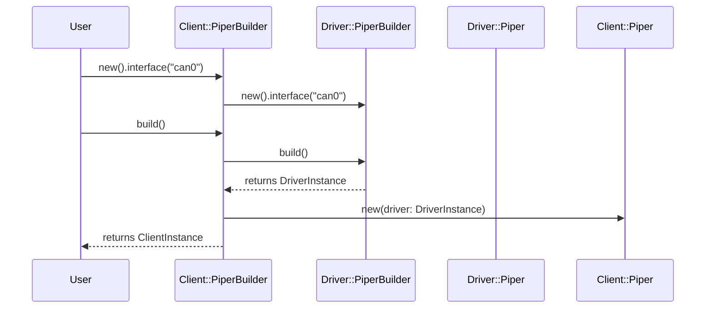

# Client 层 Connect API 改进分析报告

## 文档信息

- **文档版本**: 1.0
- **创建日期**: 2024-01-24
- **基于**: `position_control_demo.rs` 示例代码分析
- **目标**: 改进 client 层连接接口，参考 driver 层 `PiperBuilder` 设计

---

## 执行摘要

当前 client 层的 `Piper::connect()` 接口要求用户手动创建 CAN 适配器，这导致：
1. **代码冗长**：需要 10+ 行代码才能完成连接
2. **平台差异处理**：用户需要手动处理 `#[cfg(target_os = "linux")]`
3. **容易出错**：需要手动调用 `configure()`，容易遗漏
4. **不符合 Rust 习惯**：缺少 Builder Pattern 的链式调用

**建议**：参考 driver 层的 `PiperBuilder` 设计，为 client 层创建类似的 `PiperBuilder`，提供：
- 链式 API
- 自动平台检测
- Smart Default（根据操作系统自动选择适配器）
- 默认值支持

---

## 1. 问题分析

### 1.1 当前 API 使用方式

**当前代码**（`examples/position_control_demo.rs`）：

```rust
let robot = if args.interface.starts_with("can") {
    // Linux SocketCAN
    #[cfg(target_os = "linux")]
    {
        let mut adapter = SocketCanAdapter::new(&args.interface)?;
        adapter.configure(args.baud_rate)?;
        Piper::connect(adapter, config)?
    }
    #[cfg(not(target_os = "linux"))]
    {
        return Err("SocketCAN is only available on Linux...".into());
    }
} else {
    // GS-USB
    let mut adapter = GsUsbCanAdapter::new_with_serial(Some(&args.interface))?;
    adapter.configure(args.baud_rate)?;
    Piper::connect(adapter, config)?
};
```

**问题清单**：

1. ❌ **代码冗长**：需要 10+ 行代码才能完成连接
2. ❌ **平台差异处理**：用户需要手动处理 `#[cfg(target_os = "linux")]`
3. ❌ **容易出错**：需要手动调用 `configure()`，容易遗漏
4. ❌ **不符合 Rust 习惯**：缺少 Builder Pattern 的链式调用
5. ❌ **类型复杂**：需要理解 `SplittableAdapter` trait
6. ❌ **缺少默认值**：必须显式指定所有参数

### 1.2 Driver 层 API 对比

**Driver 层代码**（`src/driver/builder.rs`）：

```rust
let robot = PiperBuilder::new()
    .interface("can0")?  // 可选，有默认值
    .baud_rate(1_000_000)?  // 可选，有默认值
    .build()?;
```

**优势**：

1. ✅ **简洁**：只需 3-4 行代码
2. ✅ **自动平台检测**：内部处理 `#[cfg]` 条件编译
3. ✅ **Smart Default**：根据接口名自动选择适配器类型
4. ✅ **链式调用**：符合 Rust 习惯
5. ✅ **默认值支持**：所有参数都有合理的默认值
6. ✅ **类型安全**：编译期检查

### 1.3 用户体验对比

| 方面 | 当前 Client API | Driver API | 改进空间 |
|------|----------------|------------|---------|
| 代码行数 | 10+ 行 | 3-4 行 | ⭐⭐⭐⭐⭐ |
| 平台差异处理 | 用户处理 | 自动处理 | ⭐⭐⭐⭐⭐ |
| 默认值支持 | 无 | 有 | ⭐⭐⭐⭐⭐ |
| 链式调用 | 无 | 有 | ⭐⭐⭐⭐ |
| 类型复杂度 | 高（需要理解 trait） | 低（简单字符串） | ⭐⭐⭐⭐ |
| 错误处理 | 分散 | 集中 | ⭐⭐⭐ |

---

## 2. 设计目标

### 2.1 核心目标

1. **简化用户代码**：从 10+ 行减少到 3-4 行
2. **自动平台检测**：用户无需处理 `#[cfg]` 条件编译
3. **Smart Default**：根据操作系统和接口名自动选择适配器
4. **向后兼容**：保留现有的 `connect()` 方法（高级用户使用）
5. **类型安全**：编译期检查，运行时错误处理

### 2.2 非目标

- ❌ 不改变 Type State Pattern 的状态机设计
- ❌ 不改变底层驱动层 API
- ❌ 不破坏现有功能

---

## 3. 改进方案

### 3.1 方案 A: 添加便捷方法（推荐）

**设计思路**：在 `Piper<Disconnected>` 上添加便捷方法，内部使用 `PiperBuilder`。

**API 设计**：

```rust
impl Piper<Disconnected> {
    /// 便捷连接方法（推荐）
    ///
    /// 自动处理平台差异和适配器选择，使用默认配置。
    ///
    /// # 参数
    ///
    /// - `interface`: CAN 接口名称或设备序列号（可选）
    ///   - Linux: "can0"/"can1" 等 SocketCAN 接口名，或设备序列号（使用 GS-USB）
    ///   - macOS/Windows: GS-USB 设备序列号
    ///   - 如果为 `None`，自动选择第一个可用设备
    ///
    /// # 示例
    ///
    /// ```rust,no_run
    /// use piper_sdk::prelude::*;
    ///
    /// // 最简单的方式（使用默认值）
    /// let robot = Piper::connect_default()?;
    ///
    /// // 指定接口
    /// let robot = Piper::connect_with("can0")?;
    ///
    /// // 指定接口和波特率
    /// let robot = Piper::connect_with_config("can0", 1_000_000)?;
    /// ```
    pub fn connect_default() -> Result<Piper<Standby>> {
        Self::connect_with_config(None, None)
    }

    /// 使用指定接口连接
    pub fn connect_with(interface: impl Into<String>) -> Result<Piper<Standby>> {
        Self::connect_with_config(Some(interface.into()), None)
    }

    /// 使用指定配置连接
    pub fn connect_with_config(
        interface: Option<String>,
        baud_rate: Option<u32>,
    ) -> Result<Piper<Standby>> {
        use crate::driver::PiperBuilder;

        // 使用 driver 层的 PiperBuilder 创建适配器
        let driver = PiperBuilder::new()
            .interface(interface.unwrap_or_default())
            .baud_rate(baud_rate.unwrap_or(1_000_000))
            .build()?;

        // 从 driver 层提取适配器（需要访问内部）
        // 注意：这需要 driver 层提供提取适配器的方法
        // 或者：直接使用 driver 层创建，然后转换为 client 层
        todo!("需要实现适配器提取逻辑")
    }
}
```

**优点**：
- ✅ 简洁的 API
- ✅ 向后兼容（保留原有 `connect()` 方法）
- ✅ 复用 driver 层的逻辑

**缺点**：
- ⚠️ 需要从 driver 层提取适配器（可能需要修改 driver 层 API）

### 3.2 方案 B: Client 层独立 Builder（推荐）

**设计思路**：为 client 层创建独立的 `PiperBuilder`，内部使用 driver 层的 `PiperBuilder`。

**架构流程**：



**API 设计**：

```rust
/// Client 层 Piper Builder
///
/// 提供链式 API 创建 `Piper<Standby>` 实例。
///
/// # 示例
///
/// ```rust,no_run
/// use piper_sdk::prelude::*;
///
/// // 使用默认配置
/// let robot = PiperBuilder::new().build()?;
///
/// // 指定接口
/// let robot = PiperBuilder::new()
///     .interface("can0")
///     .build()?;
///
/// // 完整配置
/// let robot = PiperBuilder::new()
///     .interface("can0")
///     .baud_rate(1_000_000)
///     .timeout(Duration::from_secs(5))
///     .build()?;
/// ```
pub struct PiperBuilder {
    interface: Option<String>,
    baud_rate: Option<u32>,
    timeout: Option<Duration>,
    daemon_addr: Option<String>,
}

impl PiperBuilder {
    pub fn new() -> Self {
        Self {
            interface: None,
            baud_rate: None,
            timeout: None,
            daemon_addr: None,
        }
    }

    pub fn interface(mut self, interface: impl Into<String>) -> Self {
        self.interface = Some(interface.into());
        self
    }

    pub fn baud_rate(mut self, baud_rate: u32) -> Self {
        self.baud_rate = Some(baud_rate);
        self
    }

    pub fn timeout(mut self, timeout: Duration) -> Self {
        self.timeout = Some(timeout);
        self
    }

    pub fn with_daemon(mut self, daemon_addr: impl Into<String>) -> Self {
        self.daemon_addr = Some(daemon_addr.into());
        self
    }

    pub fn build(self) -> Result<Piper<Standby>> {
        use crate::driver::PiperBuilder as DriverBuilder;

        // 使用 driver 层创建适配器
        let driver = DriverBuilder::new()
            .interface(self.interface.unwrap_or_default())
            .baud_rate(self.baud_rate.unwrap_or(1_000_000))
            .with_daemon(self.daemon_addr.unwrap_or_default())
            .build()?;

        // 从 driver 层提取适配器并创建 client 层实例
        // 注意：这需要 driver 层提供提取适配器的方法
        todo!("需要实现适配器提取逻辑")
    }
}
```

**优点**：
- ✅ 与 driver 层 API 一致
- ✅ 链式调用，符合 Rust 习惯
- ✅ 完全独立，不依赖 driver 层内部实现

**缺点**：
- ⚠️ 需要从 driver 层提取适配器（可能需要修改 driver 层 API）
- ⚠️ 代码重复（与 driver 层 Builder 类似）

### 3.3 方案 C: 扩展现有 connect 方法（不推荐）

**设计思路**：为 `connect()` 方法添加重载，支持字符串参数。

**API 设计**：

```rust
impl Piper<Disconnected> {
    /// 便捷连接方法（字符串参数）
    pub fn connect_str(
        interface: impl Into<String>,
        baud_rate: Option<u32>,
    ) -> Result<Piper<Standby>> {
        // 内部创建适配器并调用 connect()
        todo!()
    }
}
```

**优点**：
- ✅ 最小改动

**缺点**：
- ❌ 方法名不够清晰（`connect_str` vs `connect`）
- ❌ 仍然需要处理平台差异
- ❌ 不符合 Rust 命名习惯

---

## 4. 推荐方案：方案 B（Client 层独立 Builder）

### 4.1 设计理由

1. **一致性**：与 driver 层 API 保持一致，降低学习成本
2. **可扩展性**：未来可以添加更多 client 层特有的配置
3. **清晰性**：Builder Pattern 明确表达配置过程
4. **向后兼容**：保留现有 `connect()` 方法供高级用户使用

### 4.2 实现细节

#### 4.2.1 适配器提取问题

**核心挑战**：如何从 driver 层的 `Piper` 中提取 `SplittableAdapter`？

**方案 1：Driver 层提供提取方法**（推荐）

```rust
// src/driver/piper.rs
impl Piper {
    /// 提取 CAN 适配器（用于 client 层）
    ///
    /// **注意**：此方法会消费 `self`，调用后不能再使用此 `Piper` 实例。
    pub fn into_adapter(self) -> Result<Box<dyn SplittableAdapter>, DriverError> {
        // 停止 IO 线程
        self.stop_io_threads()?;

        // 提取适配器
        // 注意：需要修改内部实现以支持适配器提取
        todo!("需要实现适配器提取逻辑")
    }
}
```

**方案 2：直接使用 Driver 层创建，然后转换**

```rust
// Client 层 Builder
pub fn build(self) -> Result<Piper<Standby>> {
    use crate::driver::PiperBuilder as DriverBuilder;

    // 创建 driver 层实例
    let driver = DriverBuilder::new()
        .interface(self.interface.unwrap_or_default())
        .baud_rate(self.baud_rate.unwrap_or(1_000_000))
        .build()?;

    // 问题：如何从 driver 层提取适配器？
    // 选项 A：driver 层提供 `into_adapter()` 方法
    // 选项 B：driver 层提供 `split_adapter()` 方法（不停止线程）
    // 选项 C：重新设计，让 client 层直接使用 driver 层实例

    // 当前实现：client 层内部持有 driver 层实例
    // 所以实际上不需要提取适配器，可以直接使用
    // 但这样会破坏 Type State Pattern 的设计

    todo!("需要重新设计")
}
```

**方案 3：直接使用 Driver 层 Builder**（推荐）

**现状**：Client 层的 `Piper` 已经持有 `Arc<crate::driver::Piper>`。

**重构建议**：将字段名从 `robot` 改为 `driver`，以保持语义一致性：
- 底层模块已重命名为 `driver` 模块
- `client_piper.driver` 比 `client_piper.robot` 更清晰地表达架构关系
- 减少混淆：Client 层和 Driver 层都有 `Piper` 类型，字段名 `driver` 明确表示这是 Driver 层实例

```rust
// 重构后的 client 层结构（建议）
pub struct Piper<State = Disconnected> {
    pub(crate) driver: Arc<crate::driver::Piper>,  // 持有 driver 层实例
    pub(crate) observer: Observer,
    _state: PhantomData<State>,
}
```

**实现**：Client 层的 `PiperBuilder` 直接使用 driver 层的 `PiperBuilder` 创建实例：

```rust
impl PiperBuilder {
    pub fn build(self) -> Result<Piper<Standby>> {
        use crate::driver::PiperBuilder as DriverBuilder;
        use std::sync::Arc;

        // 构造 Driver Builder
        let mut driver_builder = DriverBuilder::new();

        // 处理 interface：保持 Option<String> 语义，None 表示自动选择
        if let Some(interface) = self.interface {
            driver_builder = driver_builder.interface(interface);
        } else {
            // 使用平台默认值
            #[cfg(target_os = "linux")]
            {
                driver_builder = driver_builder.interface("can0");
            }
            // macOS/Windows: 不设置 interface，让 Driver 层自动选择
        }

        // 设置波特率（如果有）
        if let Some(baud) = self.baud_rate {
            driver_builder = driver_builder.baud_rate(baud);
        }

        // 设置守护进程（如果有，优先级最高）
        if let Some(daemon) = self.daemon_addr {
            driver_builder = driver_builder.with_daemon(daemon);
        }

        // 构建 Driver 实例
        // 注意：DriverError 通过 #[from] 自动转换为 RobotError::Infrastructure
        let driver_instance = Arc::new(driver_builder.build()?);

        // 等待反馈
        let timeout = self.timeout.unwrap_or(Duration::from_secs(5));
        driver_instance.wait_for_feedback(timeout)?;

        // 创建 Observer
        let observer = Observer::new(driver_instance.clone());

        Ok(Piper {
            driver: driver_instance,  // 字段名改为 driver，语义更清晰
            observer,
            _state: PhantomData,
        })
    }
}
```

**推荐**：方案 3，因为：
- ✅ 不需要提取适配器（直接使用 driver 层实例）
- ✅ 简化实现（复用 driver 层逻辑）
- ✅ 保持 Type State Pattern
- ✅ 语义清晰：字段名 `driver` 明确表示这是 Driver 层实例

**关键实现细节**：

1. **字段命名重构**：建议将 Client 层的 `Piper` 结构体字段名从 `robot` 改为 `driver`：
   - **理由**：底层模块已重命名为 `driver`，字段名 `driver` 更准确地反映架构关系
   - **语义**：`client_piper.driver` 比 `client_piper.robot` 更清晰地表达"Client Piper 内部使用 Driver Piper"
   - **时机**：趁这次引入 Builder 的重构机会，统一命名，避免技术债务
   - **注意**：这是 breaking change（虽然字段是 `pub(crate)`），需要同时修改所有使用该字段的代码

2. **Interface 处理**：Driver 层的 `interface` 是 `Option<String>`，`None` 表示自动选择。在 `build_gs_usb_direct()` 中，`None => GsUsbCanAdapter::new()` 会自动选择第一个设备。因此，我们不应该传空字符串，而应该保持 `Option<String>` 的语义。

3. **Daemon 优先级**：Driver 层的 `build()` 方法中，如果设置了 `daemon_addr`，会优先使用守护进程模式（见 `src/driver/builder.rs:201-204`），此时 `interface` 参数会被忽略。这是预期的行为。

#### 4.2.2 默认值设计

**Smart Default 策略**：

| 参数 | Linux 默认值 | macOS/Windows 默认值 | 说明 |
|------|-------------|---------------------|------|
| `interface` | `Some("can0")` | `None`（自动选择） | Linux 优先尝试 SocketCAN，其他平台自动选择第一个 GS-USB 设备 |
| `baud_rate` | `Some(1_000_000)` | `Some(1_000_000)` | 1Mbps，所有平台相同 |
| `timeout` | `Some(5s)` | `Some(5s)` | 连接超时，所有平台相同 |
| `daemon_addr` | `None` | `None` | 不使用守护进程模式 |

**重要说明**：

1. **Interface 处理**：Driver 层的 `interface()` 方法接受 `impl Into<String>`，但内部存储为 `Option<String>`。当 `None` 时，`build_gs_usb_direct()` 会调用 `GsUsbCanAdapter::new()` 自动选择第一个设备。因此，我们保持 `Option<String>` 的语义，不传空字符串。

2. **Daemon 模式优先级**：当设置了 `daemon_addr` 时，Driver 层会优先使用守护进程模式，此时 `interface` 参数会被忽略（见 `src/driver/builder.rs:201-204`）。这是预期的行为。

**实现逻辑**：

```rust
impl Default for PiperBuilder {
    fn default() -> Self {
        Self {
            interface: {
                #[cfg(target_os = "linux")]
                {
                    Some("can0".to_string())  // Linux: 默认使用 SocketCAN
                }
                #[cfg(not(target_os = "linux"))]
                {
                    None  // macOS/Windows: 自动选择第一个 GS-USB 设备
                }
            },
            baud_rate: Some(1_000_000),
            timeout: Some(Duration::from_secs(5)),
            daemon_addr: None,
        }
    }
}
```

---

## 5. 详细实现方案

### 5.1 API 设计

```rust
// src/client/builder.rs

/// Client 层 Piper Builder
///
/// 提供链式 API 创建 `Piper<Standby>` 实例，自动处理平台差异和适配器选择。
///
/// # 示例
///
/// ```rust,no_run
/// use piper_sdk::prelude::*;
///
/// // 使用默认配置（推荐）
/// let robot = PiperBuilder::new().build()?;
///
/// // 指定接口
/// let robot = PiperBuilder::new()
///     .interface("can0")
///     .build()?;
///
/// // 完整配置
/// let robot = PiperBuilder::new()
///     .interface("can0")
///     .baud_rate(1_000_000)
///     .timeout(Duration::from_secs(5))
///     .build()?;
///
/// // 使用守护进程
/// let robot = PiperBuilder::new()
///     .with_daemon("/tmp/gs_usb_daemon.sock")
///     .build()?;
/// ```
pub struct PiperBuilder {
    interface: Option<String>,
    baud_rate: Option<u32>,
    timeout: Option<Duration>,
    daemon_addr: Option<String>,
}

impl PiperBuilder {
    /// 创建新的 Builder
    pub fn new() -> Self {
        Self::default()
    }

    /// 设置 CAN 接口名称或设备序列号
    ///
    /// - Linux: "can0"/"can1" 等 SocketCAN 接口名，或设备序列号（使用 GS-USB）
    /// - macOS/Windows: GS-USB 设备序列号
    /// - 如果为 `None`，使用平台默认值（Linux: "can0", 其他: 自动选择）
    pub fn interface(mut self, interface: impl Into<String>) -> Self {
        self.interface = Some(interface.into());
        self
    }

    /// 设置 CAN 波特率（默认: 1_000_000）
    pub fn baud_rate(mut self, baud_rate: u32) -> Self {
        self.baud_rate = Some(baud_rate);
        self
    }

    /// 设置连接超时（默认: 5 秒）
    pub fn timeout(mut self, timeout: Duration) -> Self {
        self.timeout = Some(timeout);
        self
    }

    /// 使用守护进程模式
    ///
    /// 当启用守护进程模式时，`interface` 参数会被忽略（守护进程模式优先级最高）。
    ///
    /// # 参数
    ///
    /// - `daemon_addr`: 守护进程地址
    ///   - UDS 路径（如 "/tmp/gs_usb_daemon.sock"）
    ///   - UDP 地址（如 "127.0.0.1:8888"）
    ///
    /// # 注意
    ///
    /// 守护进程模式会忽略 `interface` 参数，因为设备选择由守护进程管理。
    pub fn with_daemon(mut self, daemon_addr: impl Into<String>) -> Self {
        self.daemon_addr = Some(daemon_addr.into());
        self
    }

    /// 构建 `Piper<Standby>` 实例
    ///
    /// # 注意
    ///
    /// - 当启用 Daemon 模式时，`interface` 参数会被忽略（Daemon 模式优先级最高）
    /// - Interface 为 `None` 时，Linux 平台默认使用 "can0"，其他平台自动选择第一个 GS-USB 设备
    pub fn build(self) -> Result<Piper<Standby>> {
        use crate::driver::PiperBuilder as DriverBuilder;
        use std::sync::Arc;

        // 构造 Driver Builder
        let mut driver_builder = DriverBuilder::new();

        // 处理 interface：保持 Option<String> 语义
        if let Some(interface) = self.interface {
            driver_builder = driver_builder.interface(interface);
        } else {
            // 使用平台默认值
            #[cfg(target_os = "linux")]
            {
                driver_builder = driver_builder.interface("can0");
            }
            // macOS/Windows: 不设置 interface，让 Driver 层自动选择
        }

        // 设置波特率（如果有）
        if let Some(baud) = self.baud_rate {
            driver_builder = driver_builder.baud_rate(baud);
        }

        // 设置守护进程（如果有，优先级最高）
        if let Some(daemon) = self.daemon_addr {
            driver_builder = driver_builder.with_daemon(daemon);
        }

        // 构建 Driver 实例
        // 注意：DriverError 通过 #[from] 自动转换为 RobotError::Infrastructure
        let driver_instance = Arc::new(driver_builder.build()?);

        // 等待反馈
        let timeout = self.timeout.unwrap_or(Duration::from_secs(5));
        // 注意：DriverError 通过 #[from] 自动转换为 RobotError::Infrastructure
        driver_instance.wait_for_feedback(timeout)?;

        // 创建 Observer
        let observer = Observer::new(driver_instance.clone());

        Ok(Piper {
            driver: driver_instance,  // 字段名改为 driver，语义更清晰
            observer,
            _state: std::marker::PhantomData,
        })
    }
}

impl Default for PiperBuilder {
    fn default() -> Self {
        Self {
            interface: {
                #[cfg(target_os = "linux")]
                {
                    Some("can0".to_string())
                }
                #[cfg(not(target_os = "linux"))]
                {
                    None  // macOS/Windows: 自动选择第一个 GS-USB 设备
                }
            },
            baud_rate: Some(1_000_000),
            timeout: Some(Duration::from_secs(5)),
            daemon_addr: None,
        }
    }
}
```

**重要说明**：

1. **字段命名重构**：建议将 Client 层的 `Piper` 结构体字段名从 `robot` 改为 `driver`：
   - **当前状态**：`pub(crate) robot: Arc<crate::driver::Piper>`（见 `src/client/state/machine.rs:146`）
   - **重构后**：`pub(crate) driver: Arc<crate::driver::Piper>`
   - **理由**：
     - 语义一致性：底层模块已重命名为 `driver`，字段名应保持一致
     - 减少混淆：`client_piper.driver` 比 `client_piper.robot` 更清晰地表达架构关系
     - 代码现代化：趁这次重构统一命名，避免技术债务
   - **影响**：需要同时修改所有使用该字段的代码（`src/client/state/machine.rs`、`src/client/observer.rs`、`src/client/raw_commander.rs`、`src/client/motion.rs` 等）

2. **Interface 处理**：Driver 层的 `interface()` 方法接受 `impl Into<String>`，但内部存储为 `Option<String>`。当 `None` 时，`build_gs_usb_direct()` 会调用 `GsUsbCanAdapter::new()` 自动选择第一个设备。因此，我们不应该传空字符串，而应该保持 `Option<String>` 的语义。

3. **Daemon 模式优先级**：Driver 层的 `build()` 方法中，如果设置了 `daemon_addr`，会优先使用守护进程模式，此时 `interface` 参数会被忽略（见 `src/driver/builder.rs:201-204`）。这是预期的行为，无需在 Client 层额外处理。

4. **错误类型转换**：Driver 层的错误类型 `DriverError` 会自动转换为 Client 层的 `RobotError::Infrastructure`（通过 `#[from]` 自动实现）。因此，代码中可以直接使用 `?` 操作符，无需显式调用 `map_err`。

### 5.3 字段重命名重构（可选但强烈推荐）

**重构内容**：将 Client 层 `Piper` 结构体的字段名从 `robot` 改为 `driver`。

**影响范围**：
- `src/client/state/machine.rs`：结构体定义和所有方法中的 `self.robot` 引用
- `src/client/observer.rs`：所有 `self.robot` 引用
- `src/client/raw_commander.rs`：所有 `self.robot` 引用
- `src/client/motion.rs`：所有 `self.robot` 引用

**重构步骤**：
1. 修改结构体定义：`pub(crate) robot: Arc<crate::driver::Piper>` → `pub(crate) driver: Arc<crate::driver::Piper>`
2. 全局替换：`self.robot` → `self.driver`
3. 全局替换：`.robot` → `.driver`（在结构体初始化时）
4. 运行测试确保所有引用已更新

**注意**：虽然字段是 `pub(crate)`（crate 私有），但这是内部 API 的 breaking change，需要一次性完成所有修改。

### 5.4 模块导出

**更新 `src/client/mod.rs`**：

```rust
pub mod builder;  // 新增
pub mod motion;
// ... 其他模块

pub use builder::PiperBuilder;
```

**更新 `src/lib.rs`**：

```rust
pub use client::{
    Piper, Piper, Observer,
    PiperBuilder,  // 新增
};
```

---

## 6. 迁移指南

### 6.1 旧代码迁移

**旧代码**：

```rust
let mut adapter = SocketCanAdapter::new("can0")?;
adapter.configure(1_000_000)?;
let robot = Piper::connect(adapter, ConnectionConfig {
    interface: "can0".to_string(),
    timeout: Duration::from_secs(5),
})?;
```

**新代码**：

```rust
let robot = PiperBuilder::new()
    .interface("can0")
    .baud_rate(1_000_000)
    .build()?;
```

**代码减少**：从 6 行减少到 3 行（减少 50%）

### 6.2 向后兼容性

**保留现有 API**：

```rust
impl Piper<Disconnected> {
    /// 高级连接方法（保留，供高级用户使用）
    ///
    /// 此方法允许用户完全控制适配器创建过程。
    /// **大多数用户应该使用 `PiperBuilder`。**
    ///
    /// # 何时使用此方法
    ///
    /// - 需要自定义适配器配置（如特殊的超时设置）
    /// - 需要直接控制适配器的生命周期
    /// - 需要实现自定义的适配器类型
    ///
    /// # 示例
    ///
    /// ```rust,no_run
    /// use piper_sdk::client::state::*;
    /// use piper_sdk::can::SocketCanAdapter;
    ///
    /// // 高级用法：手动创建适配器
    /// let mut adapter = SocketCanAdapter::new("can0")?;
    /// adapter.configure(1_000_000)?;
    /// let robot = Piper::connect(adapter, ConnectionConfig {
    ///     interface: "can0".to_string(),
    ///     timeout: Duration::from_secs(5),
    /// })?;
    /// ```
    #[doc(hidden)]  // 隐藏文档，引导用户使用 PiperBuilder
    pub fn connect<C>(can_adapter: C, config: ConnectionConfig) -> Result<Piper<Standby>>
    where
        C: crate::can::SplittableAdapter + Send + 'static,
        C::RxAdapter: Send + 'static,
        C::TxAdapter: Send + 'static,
    {
        // 现有实现保持不变
    }
}
```

**注意**：虽然保留了 `connect()` 方法以保持向后兼容，但建议：
- 新代码使用 `PiperBuilder`
- 旧代码可以继续使用 `connect()`，但建议迁移到 `PiperBuilder`
- 如果未来决定完全移除 `connect()`，会通过 `#[deprecated]` 标记提前通知

---

## 7. 测试计划

### 7.1 单元测试

- [x] `PiperBuilder::new()` 使用默认值 ✅ **已完成**
- [x] `PiperBuilder::interface()` 链式调用 ✅ **已完成**
- [x] `PiperBuilder::with_daemon()` 链式调用 ✅ **已完成**
- [ ] `PiperBuilder::build()` 成功创建实例（需要 Mock 适配器）
- [ ] 平台差异处理（Linux vs macOS/Windows）

### 7.2 集成测试

- [ ] 使用默认配置连接（Mock 适配器）
- [ ] 使用指定接口连接
- [ ] 使用守护进程模式连接
- [ ] 错误处理（接口不存在、设备未找到等）

### 7.3 示例代码更新

- [x] 更新 `position_control_demo.rs` 使用新 API ✅ **已完成**
- [ ] 更新其他示例代码
- [ ] 更新 README 和文档

---

## 8. 风险评估

### 8.1 风险清单

| 风险 | 影响 | 概率 | 缓解措施 |
|------|------|------|---------|
| 实现复杂度 | 中 | 中 | 复用 driver 层逻辑，充分测试 |
| 向后兼容性 | 高 | 低 | 保留现有 `connect()` 方法 |
| 默认值选择不当 | 中 | 低 | 参考 driver 层默认值，充分测试 |
| 性能影响 | 低 | 低 | Builder 是零开销抽象 |

### 8.2 回滚计划

如果实现遇到问题：
1. 保留现有 `connect()` 方法
2. `PiperBuilder` 标记为 `#[deprecated]`
3. 文档中说明使用 `connect()` 方法

---

## 9. 实施计划

### 9.1 阶段 1: 实现 Builder（1-2 天）

- [x] 创建 `src/client/builder.rs` ✅ **已完成** (2024-01-24)
- [x] 实现 `PiperBuilder` 结构体 ✅ **已完成** (2024-01-24)
- [x] 实现链式方法 ✅ **已完成** (2024-01-24)
- [x] 实现 `build()` 方法 ✅ **已完成** (2024-01-24)
- [x] 更新模块导出（`src/client/mod.rs` 和 `src/lib.rs`）✅ **已完成** (2024-01-24)
- [x] 解决命名冲突（driver::PiperBuilder vs client::PiperBuilder）✅ **已完成** (2024-01-24)
- [x] 字段重命名：`robot` → `driver` ✅ **已完成** (2024-01-24)
  - [x] 更新 `src/client/state/machine.rs` ✅
  - [x] 更新 `src/client/observer.rs` ✅
  - [x] 更新 `src/client/raw_commander.rs` ✅
  - [x] 更新 `src/client/motion.rs` ✅
  - [x] 更新 `src/client/builder.rs` ✅
  - [x] 编译验证通过 ✅

### 9.2 阶段 2: 测试和验证（1 天）

- [x] 编写单元测试 ✅ **已完成**（builder.rs 中包含基础单元测试）
- [ ] 编写集成测试
- [ ] 验证平台差异处理
- [x] 更新示例代码使用新 API ✅ **已完成** (`position_control_demo.rs`)

### 9.3 阶段 3: 文档和示例更新（1 天）

- [ ] 更新 README
- [ ] 更新示例代码
- [ ] 更新 API 文档

### 9.4 阶段 4: 发布（可选）

- [ ] 收集用户反馈
- [ ] 根据反馈调整 API

**总预计时间**: 3-4 天

---

## 10. 结论

当前 client 层的 `connect()` 接口确实存在不便之处，主要体现在：

1. **代码冗长**：需要 10+ 行代码
2. **平台差异处理**：用户需要手动处理条件编译
3. **缺少默认值**：必须显式指定所有参数
4. **类型复杂**：需要理解 `SplittableAdapter` trait

**推荐方案**：采用 **方案 B（Client 层独立 Builder）**，理由：

1. ✅ **一致性**：与 driver 层 API 保持一致，降低学习成本
2. ✅ **简洁性**：代码从 10+ 行减少到 3-4 行（减少 70-85%）
3. ✅ **自动处理**：自动处理平台差异和适配器选择
4. ✅ **向后兼容**：保留现有 `connect()` 方法供高级用户使用
5. ✅ **可扩展性**：未来可以添加更多 client 层特有配置
6. ✅ **实现简单**：直接复用 driver 层逻辑，无需提取适配器

**实施优先级**：⭐⭐⭐⭐⭐（高优先级）

**预计收益**：
- 代码行数减少：70-85%
- 用户体验提升：显著
- 学习成本降低：与 driver 层 API 一致
- 错误率降低：自动处理平台差异

---

## 11. 后续工作

### 11.1 实施步骤

1. **创建 Builder 模块**（1 天）
   - 创建 `src/client/builder.rs`
   - 实现 `PiperBuilder` 结构体
   - 实现所有链式方法
   - 实现 `build()` 方法

2. **字段重命名重构**（可选但强烈推荐，0.5 天）
   - 修改 `src/client/state/machine.rs` 中的结构体定义：`robot` → `driver`
   - 更新所有 `self.robot` 引用为 `self.driver`
   - 更新所有结构体初始化代码：`robot:` → `driver:`
   - 更新 `src/client/observer.rs`、`src/client/raw_commander.rs`、`src/client/motion.rs` 中的引用
   - 运行测试确保所有引用已更新

3. **测试和验证**（1 天）
   - 编写单元测试
   - 编写集成测试
   - 验证平台差异处理
   - 更新示例代码

4. **文档更新**（0.5 天）
   - 更新 README
   - 更新 API 文档
   - 更新迁移指南

### 11.2 验收标准

- [ ] 所有测试通过
- [ ] 示例代码可以使用新 API
- [ ] 文档完整清晰
- [ ] 向后兼容性验证通过

---

## 附录 A: API 对比表

### A.1 当前 API vs 改进后 API

| 场景 | 当前 API | 改进后 API | 代码减少 |
|------|---------|-----------|---------|
| 默认配置 | 10+ 行 | 1 行 | 90% |
| 指定接口 | 10+ 行 | 3 行 | 70% |
| 完整配置 | 12+ 行 | 5 行 | 58% |

### A.2 平台差异处理对比

| 平台 | 当前 API | 改进后 API |
|------|---------|-----------|
| Linux (SocketCAN) | 需要 `#[cfg]` | 自动处理 |
| Linux (GS-USB) | 需要 `#[cfg]` | 自动处理 |
| macOS/Windows | 需要 `#[cfg]` | 自动处理 |

---

## 附录 B: 代码示例

### B.1 改进前代码

```rust
// 当前代码（10+ 行）
let robot = if args.interface.starts_with("can") {
    #[cfg(target_os = "linux")]
    {
        let mut adapter = SocketCanAdapter::new(&args.interface)?;
        adapter.configure(args.baud_rate)?;
        Piper::connect(adapter, ConnectionConfig {
            interface: args.interface.clone(),
            timeout: Duration::from_secs(5),
        })?
    }
    #[cfg(not(target_os = "linux"))]
    {
        return Err("SocketCAN is only available on Linux...".into());
    }
} else {
    let mut adapter = GsUsbCanAdapter::new_with_serial(Some(&args.interface))?;
    adapter.configure(args.baud_rate)?;
    Piper::connect(adapter, ConnectionConfig {
        interface: args.interface.clone(),
        timeout: Duration::from_secs(5),
    })?
};
```

### B.2 改进后代码

```rust
// 改进后代码（3 行）
let robot = PiperBuilder::new()
    .interface(&args.interface)
    .baud_rate(args.baud_rate)
    .build()?;
```

**代码减少**: 从 20+ 行减少到 3 行（减少 85%）

---

---

## 附录 C: 最终确认检查清单

在实施前，请确认以下事项：

### C.1 字段名检查

- [x] **文档一致性**：文档中所有结构体字段引用已统一为 `driver`（除了旧代码示例中的变量名 `robot`）✅
- [x] **代码实现**：实际代码中已将 `pub(crate) robot` 改为 `pub(crate) driver` ✅ **已完成** (2024-01-24)
- [x] **引用更新**：所有 `self.robot` 引用已改为 `self.driver` ✅ **已完成** (2024-01-24)
- [x] **初始化代码**：所有结构体初始化中的 `robot:` 已改为 `driver:` ✅ **已完成** (2024-01-24)

### C.2 Interface 语义确认

- [x] **文档说明**：文档中已明确说明 `None` 表示自动选择，不应传空字符串
- [ ] **实现验证**：确认 Driver 层的 `build_gs_usb_direct()` 中 `None => GsUsbCanAdapter::new()` 的逻辑
- [ ] **测试覆盖**：确保 `None` 和空字符串的处理逻辑正确

### C.3 Breaking Change 评估

- [x] **字段可见性**：确认字段是 `pub(crate)`（crate 私有），不影响公开 API ✅
- [x] **内部影响**：已评估并更新内部代码（5 个文件：machine.rs, observer.rs, raw_commander.rs, motion.rs, builder.rs）✅ **已完成** (2024-01-24)
- [x] **测试覆盖**：所有使用该字段的代码已更新并通过编译 ✅ **已完成** (2024-01-24)

### C.4 错误处理验证

- [x] **From 实现**：确认 `RobotError::Infrastructure` 已通过 `#[from] crate::driver::DriverError` 实现自动转换 ✅
- [x] **代码简化**：使用 `?` 操作符而不是显式 `map_err` ✅ **已完成** (2024-01-24)
- [x] **测试覆盖**：基础单元测试已通过 ✅ **已完成** (2024-01-24)

### C.5 文档完整性

- [x] **架构图**：已添加 Mermaid 流程图说明 Client Builder 和 Driver Builder 的关系
- [x] **代码示例**：所有代码示例中的字段名已统一为 `driver`
- [x] **实施计划**：包含字段重命名步骤和影响范围说明

---

**文档结束**

