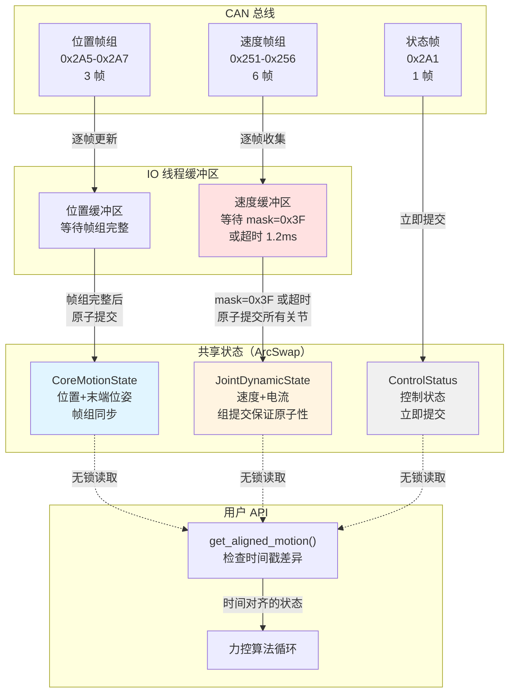

# 状态时间戳同步性分析报告

## 1. 概述

由于 `MotionState`、`DiagnosticState`、`ConfigState` 中的字段来自不同的 CAN 帧，每个 CAN 帧都有自己的硬件时间戳（`PiperFrame.timestamp_us`），这可能导致**时间不同步**的问题。

本报告分析：
1. **问题分析**：不同字段的时间戳来源差异
2. **影响评估**：时间不同步对力控算法的影响
3. **解决方案**：是否需要拆分状态，如何拆分
4. **设计建议**：最优的状态组织方式

## 2. 问题分析：时间戳来源差异

### 2.1. MotionState 字段的时间戳来源

| 字段组 | CAN 帧 ID | 帧数量 | 时间戳特性 | 同步性 |
|--------|-----------|--------|-----------|--------|
| **关节位置** | 0x2A5, 0x2A6, 0x2A7 | 3 帧 | 帧组，可能有微小延迟（<1ms） | ⚠️ 接近同步 |
| **关节速度** | 0x251~0x256 | 6 帧 | 独立帧，每个关节一帧 | ❌ 可能不同步（延迟可达数毫秒） |
| **关节电流** | 0x251~0x256 | 6 帧 | 独立帧，与速度同帧 | ⚠️ 与速度同步，但与其他字段不同步 |
| **末端位姿** | 0x2A2, 0x2A3, 0x2A4 | 3 帧 | 帧组，可能有微小延迟（<1ms） | ⚠️ 接近同步 |
| **夹爪数据** | 0x2A8 | 1 帧 | 独立帧 | ❌ 与其他字段不同步 |
| **控制状态** | 0x2A1 | 1 帧 | 独立帧，更新频率可能不同 | ❌ 与其他字段不同步 |

**关键问题**：
1. **帧组内部**（如 0x2A5, 0x2A6, 0x2A7）可能有微秒级延迟，但通常在 1ms 以内，可以认为是"准同步"的
2. **帧组之间**（如关节位置组 vs 关节速度组）可能有毫秒级延迟（取决于 CAN 总线的优先级和负载）
3. **不同更新频率**：某些帧（如 0x2A1 控制状态）的更新频率可能低于其他帧

### 2.2. DiagnosticState 字段的时间戳来源

| 字段组 | CAN 帧 ID | 帧数量 | 时间戳特性 | 同步性 |
|--------|-----------|--------|-----------|--------|
| **电机温度** | 0x261~0x266 | 6 帧 | 独立帧，每个关节一帧 | ❌ 可能不同步 |
| **驱动器温度** | 0x261~0x266 | 6 帧 | 独立帧，与电机温度同帧 | ⚠️ 与电机温度同步 |
| **关节电压** | 0x261~0x266 | 6 帧 | 独立帧，与温度同帧 | ⚠️ 与温度同步 |
| **关节电流** | 0x261~0x266 | 6 帧 | 独立帧，与温度同帧 | ⚠️ 与温度同步 |
| **保护等级** | 0x47B | 1 帧 | 配置反馈帧，更新频率低 | ❌ 与其他字段不同步 |

**关键问题**：
1. **低速反馈帧**（0x261~0x266）更新频率低（可能 10Hz），与运动数据（1kHz）不同步
2. **配置反馈帧**（0x47B）更新频率极低（仅在配置变更时），与其他字段完全不同步

### 2.3. ConfigState 字段的时间戳来源

| 字段组 | CAN 帧 ID | 帧数量 | 时间戳特性 | 同步性 |
|--------|-----------|--------|-----------|--------|
| **关节限制** | 0x473 | 1 帧/关节 | 配置反馈帧，需要查询 6 次 | ❌ 查询响应延迟，不同步 |
| **加速度限制** | 0x47C | 1 帧/关节 | 配置反馈帧，需要查询 6 次 | ❌ 查询响应延迟，不同步 |
| **末端参数** | 0x478 | 1 帧 | 配置反馈帧，更新频率低 | ❌ 与其他字段不同步 |

**关键问题**：
1. **配置反馈帧**都是**按需查询**的，不是周期性反馈
2. 查询响应可能有**数毫秒到数百毫秒**的延迟
3. 这些数据**几乎不变**，不需要实时同步

## 3. 影响评估

### 3.1. 对力控算法的影响

#### 3.1.1. 关节位置 vs 关节速度

**问题**：关节位置来自 0x2A5-0x2A7（3 帧），关节速度来自 0x251-0x256（6 帧），它们的时间戳可能不同步。

**影响**：
- **数值微分**：如果使用位置差分计算速度，不同步的数据会导致计算错误
- **PID 控制**：如果位置和速度来自不同时刻，PID 控制器的 P 和 D 项可能不匹配
- **状态估计**：卡尔曼滤波等状态估计算法需要同步的状态，不同步会导致估计偏差

**严重程度**：⭐⭐⭐⭐ **高**（直接影响控制稳定性）

#### 3.1.2. 关节位置 vs 末端位姿

**问题**：关节位置来自 0x2A5-0x2A7，末端位姿来自 0x2A2-0x2A4，它们的时间戳可能不同步。

**影响**：
- **逆运动学**：如果关节位置和末端位姿不同步，逆运动学求解会产生不一致的结果
- **雅可比矩阵**：需要同步的关节位置和末端速度/加速度，不同步会导致雅可比矩阵错误

**严重程度**：⭐⭐⭐ **中**（影响运动学计算准确性）

#### 3.1.3. 关节数据 vs 控制状态

**问题**：关节数据来自高频反馈帧（1kHz），控制状态来自 0x2A1（可能 100Hz 或更低）。

**影响**：
- **状态检查**：如果控制状态不同步，可能在错误的状态下执行控制算法
- **模式切换**：模式切换时，可能使用过时的控制状态

**严重程度**：⭐⭐ **中低**（影响状态检查，但不直接影响控制循环）

#### 3.1.4. 运动数据 vs 诊断数据

**问题**：运动数据来自高频反馈帧（1kHz），诊断数据来自低频反馈帧（10Hz）。

**影响**：
- **诊断监控**：诊断数据更新慢，不影响实时控制，但可能延迟错误检测
- **安全保护**：如果温度/电压异常，可能需要降低控制频率或停止控制

**严重程度**：⭐ **低**（不影响实时控制，只影响监控）

### 3.2. 对性能的影响

#### 3.2.1. 读取性能

**当前设计**：
```rust
pub fn get_motion_state(&self) -> MotionState {
    (**self.ctx.motion.load()).clone()
}
```

**问题**：
- 如果所有字段在一个 `MotionState` 中，`Clone` 会复制所有字段（即使有些字段已经过期）
- 如果字段来自不同时刻，复制"过期"字段没有意义

**影响**：⭐ **低**（`Clone` 开销通常很小，但如果字段很多，可能有影响）

#### 3.2.2. Frame Commit 复杂度

**当前设计**：Frame Commit 机制需要等待完整帧组（如 0x2A5, 0x2A6, 0x2A7）。

**问题**：
- 如果不同帧组的时间戳不同，是否需要为每个帧组单独维护时间戳？
- 如果某些帧组更新频率不同，是否会导致数据过期？

**影响**：⭐⭐ **中**（影响代码复杂度和维护性）

## 4. 解决方案分析

### 4.1. 方案 1：保持现有设计，在字段级别添加时间戳

**设计**：为每个字段组添加独立的时间戳。

```rust
pub struct MotionState {
    pub timestamp_joint_pos_us: u64,  // 关节位置时间戳
    pub joint_pos: [f64; 6],

    pub timestamp_joint_vel_us: u64,  // 关节速度时间戳
    pub joint_vel: [f64; 6],

    pub timestamp_end_pose_us: u64,   // 末端位姿时间戳
    pub end_pose: [f64; 6],

    // ...
}
```

**优点**：
- ✅ 保留单一状态结构，API 简单
- ✅ 用户可以看到每个字段组的时间戳
- ✅ 适合判断数据是否过期

**缺点**：
- ❌ 状态结构变大（多个时间戳字段）
- ❌ 用户需要自己判断哪些字段是同步的
- ❌ Frame Commit 逻辑变复杂（需要为每个字段组单独更新时间戳）

**适用场景**：**不推荐**，除非字段组数量很少（<3 个）

### 4.2. 方案 2：按时间同步性拆分状态

**设计**：按照 CAN 帧的时间同步性，拆分为多个子状态。

```rust
// 核心运动状态（高频，1kHz，帧组同步）
pub struct CoreMotionState {
    pub timestamp_us: u64,
    pub joint_pos: [f64; 6],        // 来自 0x2A5-0x2A7
    pub end_pose: [f64; 6],         // 来自 0x2A2-0x2A4
}

// 关节动态状态（高频，1kHz，独立帧）
pub struct JointDynamicState {
    pub timestamp_us: u64,
    pub joint_vel: [f64; 6],        // 来自 0x251-0x256
    pub joint_current: [f64; 6],    // 来自 0x251-0x256
}

// 控制状态（低频，100Hz）
pub struct ControlStatusState {
    pub timestamp_us: u64,
    pub control_mode: u8,
    pub robot_status: u8,
    pub move_mode: u8,
    // ... 来自 0x2A1
}

// 夹爪状态（中频，可能独立更新）
pub struct GripperState {
    pub timestamp_us: u64,
    pub travel: f64,
    pub torque: f64,
    // ... 来自 0x2A8
}

// 组合状态（用于兼容）
pub struct MotionState {
    pub core: Arc<ArcSwap<CoreMotionState>>,
    pub joint_dynamic: Arc<ArcSwap<JointDynamicState>>,
    pub control_status: Arc<ArcSwap<ControlStatusState>>,
    pub gripper: Arc<ArcSwap<GripperState>>,
}
```

**优点**：
- ✅ **清晰的时间同步性**：每个子状态内的字段都是同步的
- ✅ **精确的时间戳**：每个子状态都有自己的时间戳
- ✅ **Frame Commit 简化**：每个子状态可以独立进行 Frame Commit
- ✅ **灵活性高**：用户可以根据需要读取特定子状态
- ✅ **性能优化**：可以为高频子状态使用 ArcSwap，低频子状态使用 RwLock

**缺点**：
- ❌ **API 复杂化**：用户需要读取多个子状态
- ❌ **状态结构变多**：需要管理多个 ArcSwap 或 RwLock

**适用场景**：**推荐**，特别适合需要精确时间戳的力控应用

### 4.3. 方案 3：按更新频率拆分状态

**设计**：按照更新频率，拆分为"热数据"、"温数据"、"冷数据"。

```rust
// 热数据（1kHz，高频运动数据）
pub struct HotMotionState {
    pub timestamp_us: u64,
    pub joint_pos: [f64; 6],
    pub joint_vel: [f64; 6],
    pub joint_current: [f64; 6],
    pub end_pose: [f64; 6],
}

// 温数据（100Hz，控制状态）
pub struct WarmControlState {
    pub timestamp_us: u64,
    pub control_mode: u8,
    pub robot_status: u8,
    pub move_mode: u8,
    pub gripper_travel: f64,
}

// 冷数据（10Hz，诊断数据）
pub struct ColdDiagnosticState {
    pub timestamp_us: u64,
    pub motor_temps: [f32; 6],
    pub driver_temps: [f32; 6],
    // ...
}
```

**优点**：
- ✅ **清晰的频率划分**：与 TDD 文档中的"热/温/冷"概念一致
- ✅ **性能优化**：可以为不同频率的状态使用不同的同步机制（ArcSwap vs RwLock）
- ✅ **API 简化**：比方案 2 更简单，但仍保留了时间同步性

**缺点**：
- ❌ **时间同步性不完美**：热数据中的字段可能仍不同步（如关节位置 vs 关节速度）
- ❌ **需要权衡**：在"清晰的时间同步性"和"简单的 API"之间权衡

**适用场景**：**部分推荐**，适合不需要精确时间戳的应用

### 4.4. 方案 4：混合方案（基础版）

**设计**：结合方案 2 和方案 3，按时间同步性拆分热数据，按频率拆分温/冷数据。

```rust
// ============================================================
// 热数据（1kHz，高频运动数据）
// ============================================================

/// 核心运动状态（帧组同步）
pub struct CoreMotionState {
    pub timestamp_us: u64,
    pub joint_pos: [f64; 6],        // 来自 0x2A5-0x2A7（帧组）
    pub end_pose: [f64; 6],         // 来自 0x2A2-0x2A4（帧组）
}

/// 关节动态状态（独立帧）
pub struct JointDynamicState {
    pub timestamp_us: u64,
    pub joint_vel: [f64; 6],        // 来自 0x251-0x256（独立帧）
    pub joint_current: [f64; 6],    // 来自 0x251-0x256（独立帧）
}
```

**⚠️ 存在问题**：
- **状态撕裂风险**：如果收到一帧速度就立即更新 `ArcSwap`，会导致 6 个关节的速度来自不同时刻（前 3 个关节是新的，后 3 个是旧的）
- **性能问题**：每次更新都会触发 `ArcSwap` 切换，6 帧会导致 6 次切换
- **时间对齐缺失**：跨状态读取时，没有明确的机制来检查或处理时间戳差异

### 4.5. 方案 4+：混合方案 + Buffered Commit Strategy（强烈推荐）

**设计**：在方案 4 的基础上，引入**"缓冲提交（Buffered Commit）"**机制，解决 `JointDynamicState` 的内部不同步问题。

```rust
// ============================================================
// 热数据（1kHz，高频运动数据）
// ============================================================

/// 核心运动状态（帧组同步）
pub struct CoreMotionState {
    pub timestamp_us: u64,
    pub joint_pos: [f64; 6],        // 来自 0x2A5-0x2A7（帧组）
    pub end_pose: [f64; 6],         // 来自 0x2A2-0x2A4（帧组）
}

/// 关节动态状态（独立帧，但通过缓冲提交保证一致性）
pub struct JointDynamicState {
    /// 整个组的大致时间戳（最新一帧的时间）
    pub group_timestamp_us: u64,

    pub joint_vel: [f64; 6],        // 来自 0x251-0x256（独立帧）
    pub joint_current: [f64; 6],    // 来自 0x251-0x256（独立帧）

    /// 每个关节的具体更新时间（用于调试或高阶插值）
    pub timestamps: [u64; 6],

    /// 有效性掩码（Bit 0-5 对应 Joint 1-6）
    /// - 1 表示本周期内已更新
    /// - 0 表示未更新（可能是丢帧）
    pub valid_mask: u8,
}

// ============================================================
// 温数据（100Hz，控制状态）
// ============================================================

pub struct ControlStatusState {
    pub timestamp_us: u64,
    pub control_mode: u8,
    pub robot_status: u8,
    pub move_mode: u8,
    pub teach_status: u8,
    pub motion_status: u8,
    pub trajectory_point_index: u8,
    pub fault_angle_limit: [bool; 6],
    pub fault_comm_error: [bool; 6],
    pub gripper_travel: f64,
    pub gripper_torque: f64,
    // ... 来自 0x2A1 和 0x2A8
}

// ============================================================
// 冷数据（10Hz 或按需，诊断和配置数据）
// ============================================================

pub struct DiagnosticState {
    pub timestamp_us: u64,
    pub motor_temps: [f32; 6],
    pub driver_temps: [f32; 6],
    pub joint_voltage: [f32; 6],
    pub joint_bus_current: [f32; 6],
    pub protection_levels: [u8; 6],
    // ... 来自 0x261-0x266 和 0x47B
}

pub struct ConfigState {
    // 配置数据通常没有时间戳（因为几乎不变）
    pub joint_limits_max: [f64; 6],
    pub joint_limits_min: [f64; 6],
    pub joint_max_velocity: [f64; 6],
    pub max_acc_limits: [f64; 6],
    // ... 来自配置反馈帧（按需查询）
}

// ============================================================
// 总上下文（聚合所有状态）
// ============================================================

pub struct PiperContext {
    // 热数据：使用 ArcSwap，无锁读取
    pub core_motion: Arc<ArcSwap<CoreMotionState>>,
    pub joint_dynamic: Arc<ArcSwap<JointDynamicState>>,

    // 温数据：使用 ArcSwap 或 RwLock（取决于读取频率）
    pub control_status: Arc<ArcSwap<ControlStatusState>>,

    // 冷数据：使用 RwLock
    pub diagnostics: Arc<RwLock<DiagnosticState>>,
    pub config: Arc<RwLock<ConfigState>>,
}
```

**核心改进**：
1. **Group Commit 机制**：收集 6 个关节的速度帧，集齐后一次性原子提交，避免状态撕裂
2. **超时保护**：如果 1.2ms 内未集齐 6 帧，也进行提交（防止丢帧导致死锁）
3. **有效性标记**：通过 `valid_mask` 标记哪些关节的数据已更新，哪些可能丢失
4. **细粒度时间戳**：`timestamps` 数组记录每个关节的更新时间，支持调试和插值

**优点**：
- ✅ **原子性视图**：`JointDynamicState` 内的 6 个关节数据来自同一 CAN 传输周期（尽可能）
- ✅ **最佳时间同步性**：每个子状态内的字段都是同步的
- ✅ **清晰的频率划分**：热/温/冷数据分离，性能优化
- ✅ **精确的时间戳**：每个子状态都有自己的时间戳
- ✅ **灵活的组合**：用户可以根据需要读取特定子状态，或组合读取
- ✅ **性能优化**：将 6 次 `ArcSwap` 写操作合并为 1 次

**缺点**：
- ❌ **API 复杂化**：需要读取多个子状态，但可以通过 helper 方法简化
- ⚠️ **延迟增加**：如果等待集齐 6 帧，可能有微秒级延迟（但可接受，因为保证了原子性）

**适用场景**：**强烈推荐**，适合需要精确时间戳和性能优化的力控应用，特别是多关节协调控制场景

## 5. 设计建议

### 5.1. 推荐方案：混合方案 + Buffered Commit（方案 4+）

**理由**：
1. **原子性保证**：通过 Group Commit 机制，避免 `JointDynamicState` 内部的状态撕裂（前 3 个关节新，后 3 个关节旧）
2. **时间同步性**：每个子状态内的字段都是同步的，避免时间不同步导致的控制误差
3. **性能优化**：将 6 次 `ArcSwap` 写操作合并为 1 次，减少 cache thrashing
4. **精确的时间戳**：每个子状态都有自己的时间戳，用户可以判断数据是否过期
5. **灵活性**：用户可以根据需要读取特定子状态，避免不必要的 Clone
6. **容错性**：通过 `valid_mask` 和超时机制，处理丢帧情况

**为什么方案 4 需要改进**：
- **物理映射准确**：承认硬件的局限性，位置数据（帧组）和速度数据（独立帧）在物理链路上就是不同步的
- **状态撕裂风险**：如果收到一帧速度就立即更新，会导致 6 个关节的速度来自不同时刻
- **多关节协调需求**：对于计算科里奥利力矩阵等动力学算法，时间扭曲会导致计算出的力矩震荡

### 5.2. API 设计建议

#### 5.2.1. 基础 API（细粒度读取）

```rust
impl Piper {
    /// 获取核心运动状态（帧组同步）
    pub fn get_core_motion(&self) -> CoreMotionState {
        (**self.ctx.core_motion.load()).clone()
    }

    /// 获取关节动态状态（独立帧）
    pub fn get_joint_dynamic(&self) -> JointDynamicState {
        (**self.ctx.joint_dynamic.load()).clone()
    }

    /// 获取控制状态（低频）
    pub fn get_control_status(&self) -> ControlStatusState {
        (**self.ctx.control_status.load()).clone()
    }

    /// 获取诊断状态（低频）
    pub fn get_diagnostics(&self) -> Result<DiagnosticState, DriverError> {
        self.ctx.diagnostics.read()
            .map(|guard| guard.clone())
            .map_err(|_| DriverError::PoisonedLock)
    }
}
```

#### 5.2.2. 组合 API（兼容性读取）

```rust
impl Piper {
    /// 获取组合运动状态（所有热数据）
    ///
    /// 注意：不同子状态的时间戳可能不同步（差异通常在毫秒级）
    pub fn get_motion_state(&self) -> CombinedMotionState {
        CombinedMotionState {
            core: self.get_core_motion(),
            joint_dynamic: self.get_joint_dynamic(),
        }
    }
}

pub struct CombinedMotionState {
    pub core: CoreMotionState,
    pub joint_dynamic: JointDynamicState,
}
```

#### 5.2.3. 时间戳检查和时间对齐 API

```rust
impl CoreMotionState {
    /// 检查状态是否过期（相对于给定时间戳）
    pub fn is_stale(&self, now_us: u64, max_age_us: u64) -> bool {
        now_us.saturating_sub(self.timestamp_us) > max_age_us
    }
}

impl JointDynamicState {
    /// 检查所有关节是否都已更新（`valid_mask == 0x3F`）
    pub fn is_complete(&self) -> bool {
        self.valid_mask == 0b111111
    }

    /// 获取未更新的关节索引（用于调试）
    pub fn missing_joints(&self) -> Vec<usize> {
        (0..6).filter(|&i| (self.valid_mask & (1 << i)) == 0).collect()
    }
}

impl Piper {
    /// 获取同步的运动状态（检查时间戳差异）
    ///
    /// 如果时间戳差异小于 `max_time_diff_us`，返回组合状态；否则返回 None
    pub fn get_synchronized_motion(&self, max_time_diff_us: u64) -> Option<CombinedMotionState> {
        let core = self.get_core_motion();
        let joint_dynamic = self.get_joint_dynamic();

        let time_diff = core.timestamp_us.abs_diff(joint_dynamic.group_timestamp_us);
        if time_diff <= max_time_diff_us {
            Some(CombinedMotionState { core, joint_dynamic })
        } else {
            None // 数据不同步，返回 None
        }
    }

    /// 获取时间对齐的运动状态（推荐用于力控算法）
    ///
    /// 以 `core.timestamp_us` 为基准时间，检查并警告时间戳差异
    pub fn get_aligned_motion(&self, max_time_diff_us: u64) -> Result<AlignedMotionState, AlignmentError> {
        let core = self.get_core_motion();
        let joint_dynamic = self.get_joint_dynamic();

        let time_diff = core.timestamp_us.abs_diff(joint_dynamic.group_timestamp_us);

        if time_diff > max_time_diff_us {
            return Err(AlignmentError::TimeMismatch {
                core_ts: core.timestamp_us,
                dynamic_ts: joint_dynamic.group_timestamp_us,
                diff_us: time_diff,
            });
        }

        // 检查速度数据是否完整
        if !joint_dynamic.is_complete() {
            let missing = joint_dynamic.missing_joints();
            warn!("Velocity data incomplete: missing joints {:?}", missing);
        }

        Ok(AlignedMotionState {
            joint_pos: core.joint_pos,
            joint_vel: joint_dynamic.joint_vel,
            joint_current: joint_dynamic.joint_current,
            end_pose: core.end_pose,
            timestamp: core.timestamp_us,  // 使用位置数据的时间戳作为基准
            time_diff_us: time_diff as i64,
        })
    }
}

/// 时间对齐后的运动状态
pub struct AlignedMotionState {
    pub joint_pos: [f64; 6],
    pub joint_vel: [f64; 6],
    pub joint_current: [f64; 6],
    pub end_pose: [f64; 6],
    pub timestamp: u64,          // 基准时间戳（来自位置数据）
    pub time_diff_us: i64,       // 速度数据与位置数据的时间差（用于调试）
}

#[derive(Debug, thiserror::Error)]
pub enum AlignmentError {
    #[error("Time mismatch: core={core_ts}us, dynamic={dynamic_ts}us, diff={diff_us}us")]
    TimeMismatch {
        core_ts: u64,
        dynamic_ts: u64,
        diff_us: u64,
    },
}
```

**API 使用建议**：
- **力控算法**：使用 `get_aligned_motion()`，确保位置和速度的时间戳差异在可接受范围内
- **状态监控**：使用 `get_synchronized_motion()`，简单地检查时间戳差异
- **调试诊断**：使用 `JointDynamicState::is_complete()` 和 `missing_joints()` 检查数据完整性

### 5.3. Frame Commit 逻辑调整（方案 4+ 改进版）

```rust
fn io_loop(
    mut can: impl CanAdapter,
    cmd_rx: Receiver<PiperFrame>,
    ctx: Arc<PiperContext>,
    config: PipelineConfig,
) {
    // === 核心运动状态：帧组同步 ===
    let mut pending_core_motion = CoreMotionState::default();

    // === 关节动态状态：缓冲提交（关键改进） ===
    let mut pending_joint_dynamic = JointDynamicState::default();
    let mut vel_update_mask: u8 = 0;        // 位掩码：已收到的关节
    let mut last_vel_commit_time_us: u64 = 0;

    loop {
        let frame = match can.receive() {
            Ok(frame) => frame,
            Err(e) => { /* ... */ }
        };

        match frame.id {
            // === 核心运动状态（帧组同步） ===
            ID_JOINT_FEEDBACK_12 => {
                if let Ok(feedback) = JointFeedback12::try_from(frame) {
                    pending_core_motion.joint_pos[0] = feedback.j1_rad();
                    pending_core_motion.joint_pos[1] = feedback.j2_rad();
                    // 不提交，等待完整帧组
                }
            }
            ID_JOINT_FEEDBACK_34 => {
                if let Ok(feedback) = JointFeedback34::try_from(frame) {
                    pending_core_motion.joint_pos[2] = feedback.j3_rad();
                    pending_core_motion.joint_pos[3] = feedback.j4_rad();
                }
            }
            ID_JOINT_FEEDBACK_56 => {
                if let Ok(feedback) = JointFeedback56::try_from(frame) {
                    pending_core_motion.joint_pos[4] = feedback.j5_rad();
                    pending_core_motion.joint_pos[5] = feedback.j6_rad();

                    // 【Frame Commit】关节位置完整帧组已收到
                    pending_core_motion.timestamp_us = frame.timestamp_us;
                    ctx.core_motion.store(Arc::new(pending_core_motion.clone()));
                }
            }

            ID_END_POSE_1 => {
                if let Ok(feedback) = EndPoseFeedback1::try_from(frame) {
                    pending_core_motion.end_pose[0] = feedback.x() / 1000.0;  // mm → m
                    pending_core_motion.end_pose[1] = feedback.y() / 1000.0;
                }
            }
            ID_END_POSE_2 => {
                if let Ok(feedback) = EndPoseFeedback2::try_from(frame) {
                    pending_core_motion.end_pose[2] = feedback.z() / 1000.0;  // mm → m
                    pending_core_motion.end_pose[3] = feedback.rx_rad();
                }
            }
            ID_END_POSE_3 => {
                if let Ok(feedback) = EndPoseFeedback3::try_from(frame) {
                    pending_core_motion.end_pose[4] = feedback.ry_rad();
                    pending_core_motion.end_pose[5] = feedback.rz_rad();

                    // 【Frame Commit】末端位姿完整帧组已收到
                    pending_core_motion.timestamp_us = frame.timestamp_us;
                    ctx.core_motion.store(Arc::new(pending_core_motion.clone()));
                }
            }

            // === 关节动态状态（缓冲提交策略 - 核心改进） ===
            id if id >= ID_JOINT_DRIVER_HIGH_SPEED_BASE && id <= ID_JOINT_DRIVER_HIGH_SPEED_BASE + 5 => {
                let joint_index = (id - ID_JOINT_DRIVER_HIGH_SPEED_BASE) as usize;

                if let Ok(feedback) = JointDriverHighSpeedFeedback::try_from(frame) {
                    // 1. 更新缓冲区（而不是立即提交）
                    pending_joint_dynamic.joint_vel[joint_index] = feedback.speed();
                    pending_joint_dynamic.joint_current[joint_index] = feedback.current();
                    pending_joint_dynamic.timestamps[joint_index] = frame.timestamp_us;

                    // 2. 标记该关节已更新
                    vel_update_mask |= 1 << joint_index;

                    // 3. 判断是否提交（混合策略：集齐或超时）
                    let all_received = vel_update_mask == 0b111111;  // 0x3F，6 个关节全部收到
                    let time_since_last_commit = frame.timestamp_us.saturating_sub(last_vel_commit_time_us);
                    let timeout_threshold_us = 1200;  // 1.2ms 超时（防止丢帧导致死锁）

                    // 策略 A：集齐 6 个关节（严格同步）
                    // 策略 B：超时提交（容错）
                    if all_received || time_since_last_commit > timeout_threshold_us {
                        // 原子性地一次性提交所有关节的速度
                        pending_joint_dynamic.group_timestamp_us = frame.timestamp_us;
                        pending_joint_dynamic.valid_mask = vel_update_mask;

                        ctx.joint_dynamic.store(Arc::new(pending_joint_dynamic.clone()));

                        // 重置状态（准备下一轮）
                        vel_update_mask = 0;
                        last_vel_commit_time_us = frame.timestamp_us;

                        // 如果超时提交，记录警告（可能丢帧）
                        if !all_received {
                            warn!(
                                "Velocity frame commit timeout: mask={:06b}, missing joints",
                                vel_update_mask
                            );
                        }
                    }
                }
            }

            // === 控制状态（独立帧，立即提交） ===
            ID_ROBOT_STATUS => {
                if let Ok(feedback) = RobotStatusFeedback::try_from(frame) {
                    ctx.control_status.rcu(|state| {
                        let mut new = state.clone();
                        new.control_mode = feedback.control_mode as u8;
                        new.robot_status = feedback.robot_status as u8;
                        new.move_mode = feedback.move_mode as u8;
                        new.teach_status = feedback.teach_status as u8;
                        new.motion_status = feedback.motion_status as u8;
                        new.trajectory_point_index = feedback.trajectory_point_index;
                        // ... 更新其他字段
                        new.timestamp_us = frame.timestamp_us;
                        new
                    });
                }
            }

            // ... 其他帧处理 ...
        }
    }
}
```

**关键改进点**：
1. **缓冲收集**：收到速度帧后先更新缓冲区，不立即提交
2. **组提交判断**：集齐 6 帧（`mask == 0x3F`）或超时（1.2ms）后一次性提交
3. **原子性保证**：一次性提交所有 6 个关节的数据，避免状态撕裂
4. **有效性标记**：通过 `valid_mask` 记录哪些关节已更新，哪些可能丢失
5. **性能优化**：将 6 次 `ArcSwap` 写操作合并为 1 次

## 6. 架构图

以下架构图展示了方案 4+ 的数据流向和合并点：



**关键设计点**：
- **位置数据**：帧组同步，等待 3 帧完整后一次性提交
- **速度数据**：缓冲收集，等待 6 帧集齐或超时后一次性提交（保证原子性）
- **控制状态**：独立帧，立即提交（更新频率低，影响小）
- **用户 API**：提供时间对齐检查，确保位置和速度的时间戳差异在可接受范围内

## 7. 总结

### 7.1. 关键结论

1. **问题确实存在**：不同字段来自不同的 CAN 帧，时间戳可能不同步（差异可达数毫秒）
2. **状态撕裂风险**：`JointDynamicState` 如果单帧立即更新，会导致 6 个关节的速度来自不同时刻
3. **对力控算法有影响**：特别是关节位置和关节速度不同步，会导致控制误差和力矩震荡
4. **需要拆分状态**：按时间同步性拆分，而不是简单地按频率拆分
5. **推荐方案 4+**：混合方案 + Buffered Commit Strategy，解决内部不同步问题

### 7.2. 方案 4+ 的核心优势

1. **原子性保证**：通过 Group Commit 机制，避免 `JointDynamicState` 内部的状态撕裂
2. **时间同步性**：每个子状态内的字段都是同步的，避免时间不同步导致的控制误差
3. **性能优化**：将 6 次 `ArcSwap` 写操作合并为 1 次，减少 cache thrashing
4. **容错性**：通过超时机制和 `valid_mask`，处理丢帧情况
5. **精确的时间戳**：每个子状态都有自己的时间戳，用户可以判断数据是否过期
6. **灵活性**：用户可以根据需要读取特定子状态，避免不必要的 Clone

### 7.3. 实施优先级

**高优先级**（直接影响控制稳定性）：
1. ✅ 拆分 `CoreMotionState`（关节位置 + 末端位姿，帧组同步）
2. ✅ 拆分 `JointDynamicState`（关节速度 + 电流，独立帧）
3. ✅ **实施 Buffered Commit 机制**（关键！避免状态撕裂）
4. ✅ 调整 Frame Commit 逻辑，为每个子状态独立维护时间戳
5. ✅ 添加 `valid_mask` 和 `timestamps` 数组（数据完整性检查）

**中优先级**（影响状态检查）：
1. ⚠️ 拆分 `ControlStatusState`（控制状态，低频）
2. ⚠️ 调整 DiagnosticState 的时间戳处理
3. ⚠️ 实现 `get_aligned_motion()` API（时间对齐检查）

**低优先级**（不影响实时控制）：
1. 💡 添加组合 API（向后兼容）
2. 💡 添加时间戳检查 API（`is_stale()`, `is_complete()`）

### 7.4. 预期收益

1. **消除状态撕裂**：`JointDynamicState` 内的 6 个关节数据来自同一 CAN 传输周期
2. **时间同步性**：每个子状态内的字段都是同步的，避免控制误差
3. **精确的时间戳**：每个子状态都有自己的时间戳，用户可以判断数据是否过期
4. **性能优化**：减少 `ArcSwap` 写操作次数，降低 cache thrashing
5. **容错性**：通过 `valid_mask` 和超时机制，处理丢帧情况
6. **灵活性**：用户可以根据需要读取特定子状态，避免不必要的 Clone

### 7.5. 设计原则总结

1. **物理映射准确**：承认硬件的局限性，位置数据（帧组）和速度数据（独立帧）在物理链路上就是不同步的
2. **原子性优先**：宁可微秒级延迟，也要保证数据的一致性（避免状态撕裂）
3. **时间戳显式化**：不要隐藏时间戳差异，让用户能够感知和处理
4. **性能与正确性平衡**：通过 Group Commit 机制，在保证正确性的同时优化性能

---

**文档版本**: v1.0
**最后更新**: 2024-12
**分析人**: Driver 模块设计团队

